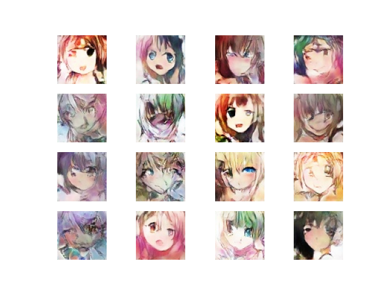
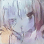

# AnimeGAN
DCGAN + WGAN implementation on anime faces
=======
This is repository with my attempt to create a GAN (generative adversarial network) model for anime faces.
Final images look like this (original images is 64x64 px):

Of course, gif:

### For traininig your own model you need:
* numpy
* pytorch (I used 1.8.1)
* opencv (with python support)
* matplotlib
* dataflow (from tensorpack)

For generating gifs you also need:
* n_sphere
* imageio

For training you should put your 64x64 images to the 'data' folder and launch notebook.

Every timestep new image samples and saves in 'generated' folder so one can easy see progress. For genearting table you need at first fill samples folder via sample.py, then launch generate_table.py. To create gif just start generate_gif.py with pre-trained model ('checkpoint' in root folder).

Dataset I used contains ~97000 anime faces cropped from images I fetched from danbooru.
For your own data put your 64x64 images to the "data" folder in the root directory.

As you can see result images is strange but one probably can easy train such GAN with he's home PC. I think problem is in weak nets. See [this](https://arxiv.org/abs/1708.05509).

[Trained model](https://drive.google.com/file/d/1nr9Z2nJNDOjPpYso4G3Z_CFmRHV_L947/view?usp=sharing)